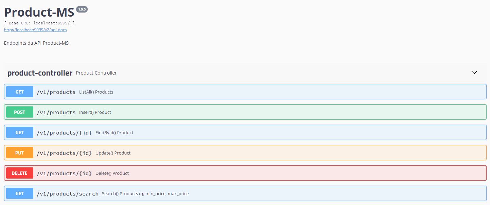

# Product-ms

Projeto desenvolvido como parte do processo seletivo da Compass UOL, requisitos podem ser encontrados [aqui](https://bitbucket.org/RecrutamentoDesafios/desafio-java-springboot/src/master/ "Requisitos Product-ms").

## Como executar?

#### Tecnologias utilizadas:
Para o desenvolvimento desta aplicação, foram utilizadas as seguintes tecnologias:
- Java 11
- Maven
- Docker
- JPQL
- Spring Boot
- JPA

#### Ferramentas necessárias:
- [Docker for Windows](https://docs.docker.com/desktop/windows/install/ "Download Docker").
- [Postman](https://www.postman.com/downloads/ "Download Postman")
### Docker

- Execute o seguinte comando no prompt de comando/powershell (no diretório raiz do projeto):
    ```bash
    docker-compose up -d
    ```
  
# Utilizando a API

Com o projeto em execução, é possível acessar a swagger-ui [aqui](http://localhost:9999/swagger-ui.html), onde é possível visualizar todos os endpoints configurados na aplicação.



## Observações
- Antes de executar o docker-compose, verifique se as portas 5432 e 9999 estão disponíveis.
- Para facilitar os testes, o DB iniciará populado com alguns dados.


